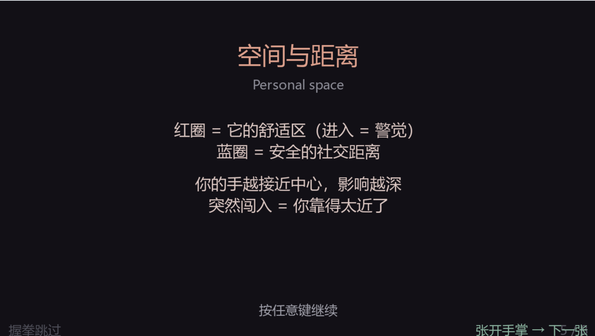
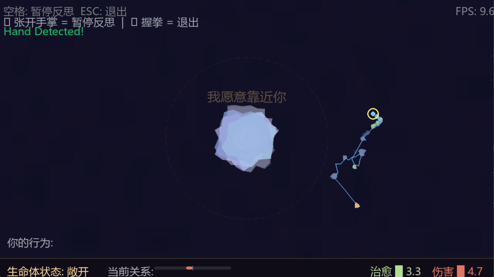
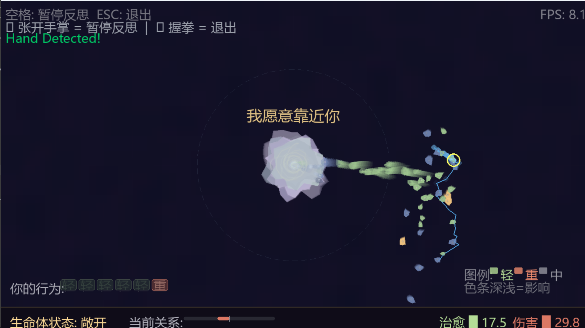
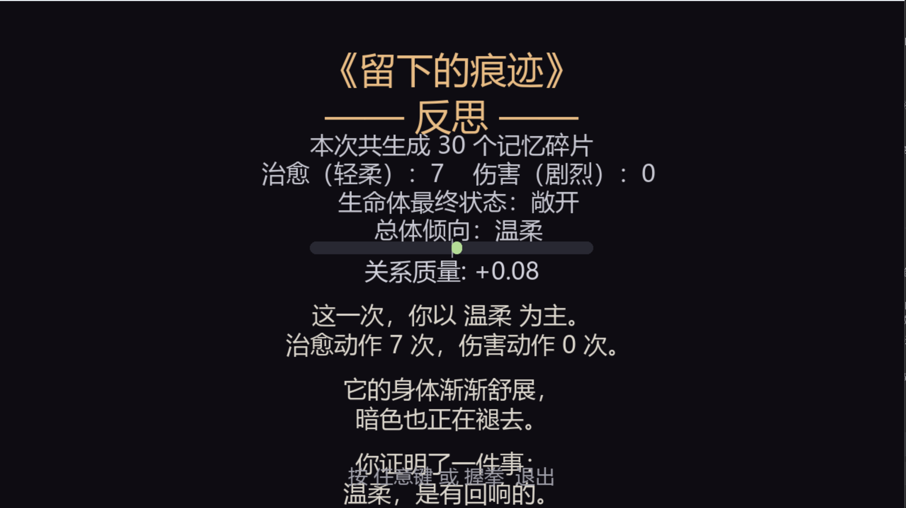

# 《留下的痕迹》 / The Trace We Leave

> 一个基于计算机视觉的交互艺术作品。
> 观众用身体动作，在屏幕中的"它"身上留下不可抹去的痕迹。

---

## 项目简介

**《留下的痕迹》** 是一件关于"人与人之间影响"的交互艺术作品。
观众通过摄像头与屏幕中央的抽象有机体互动——你的每一个动作都会被记录、凝结成记忆碎片，
并**永久地**渗入有机体的内部。

- **轻柔的动作** → 暖琥珀色碎片 → 有机体慢慢变暖、变舒展
- **剧烈的动作** → 暗紫色尖锐碎片 → 留下**持久不消退的暗疤痕**

作品想让你看到：你的行为在他/她身上留下了什么。痕迹是真实的、累积的、几乎不可逆的。

---

## 体验流程

1. **启动引导**：屏幕显示作品标题与核心提问（用手势翻页：✋ 张开手掌）
2. **开始交互**：将手放入摄像头视野，移动产生轨迹
3. **动作结束**：静止约 0.8 秒，动作会"凝结"为记忆碎片
4. **碎片渗透**：碎片漂向有机体，被膜吸收，进入内部
5. **结构变化**：有机体的颜色、内部纹理、疤痕都持续累积
6. **反思结束**：用 ✊ 握拳手势退出 → 显示本次互动的统计与反思文字

---

## 控制方式（全部手势）

| 场景 | 手势 | 持续时间 | 作用 |
|------|------|---------|------|
| 引导界面 | ✋ 张开手掌 | 1.5 秒 | 翻到下一页 |
| 引导界面 | ✊ 握拳 | 2.0 秒 | 跳过引导 |
| 互动中 | ✋ 张开手掌 | 1.5 秒 | 进入 / 退出反思 |
| 互动中 | ✊ 握拳 | 2.0 秒 | 退出程序 |

> 键盘 `空格` = 暂停反思；`ESC` = 退出（兜底调试用）

---

## 视觉特效（最近优化）

- **粒子多层光晕**：每个记忆碎片周围有 5 层径向渐变光晕环（pygame.gfxdraw）
- **手部光晕**：指尖位置 4 层光晕 + 中心高亮，颜色随情感状态自动变化

---

## 安装与运行

### 环境要求

- **Python 3.8+**（建议 3.10 / 3.11，MediaPipe 对 3.12 兼容性较差）
- **摄像头**（内置或外接 USB 摄像头均可）
- **操作系统**：Windows 10/11、macOS、Linux 均可
- **内存**：建议 4GB 以上
- **首次运行需要联网**（pip 安装依赖）

### 一步步安装

**1. 克隆或下载本仓库**

```bash
git clone https://github.com/你的用户名/仓库名.git
cd 仓库名
```

或者直接点击 GitHub 页面上的 `Code` → `Download ZIP` 下载后解压。

**2. （推荐）创建虚拟环境**

```bash
# Windows
python -m venv venv
venv\Scripts\activate

# macOS / Linux
python3 -m venv venv
source venv/bin/activate
```

**3. 安装依赖**

```bash
pip install -r requirements.txt
```

如果 `mediapipe` 安装失败（常见于 Python 3.12+），可指定旧版 Python：

```bash
# Windows
py -3.11 -m venv venv
py -3.11 -m pip install -r requirements.txt
```

**4. 运行**

```bash
python main.py
```

启动后会出现 8 张引导卡，按住 `✋ 张开手掌 1.5 秒` 翻页，全部翻完后进入主交互。

---

## 给老师 / 评审的使用说明

如果你不想自己跑代码，可以直接看：

1. **演示视频**：<在此贴 B 站 / YouTube 链接，或上传到 GitHub Releases>
2. **截图预览**：见下方「视觉预览」小节（可补充）
3. **运行数据样例**：`sessions/` 目录下保留有 `.gitkeep`，实际运行后会自动生成示例会话文件

**如果决定亲自运行体验**：

| 步骤 | 操作 | 预期反馈 |
|------|------|---------|
| 1 | 运行 `python main.py` | 弹出窗口，显示标题卡 |
| 2 | 在摄像头前张开手掌，保持 1.5 秒 | 翻到下一页 |
| 3 | 重复 8 次翻完所有引导卡 | 自动进入主交互 |
| 4 | 在镜头前缓慢移动手 | 屏幕中央的有机体会跟着你的手晃动 |
| 5 | 静止手约 0.8 秒 | 产生一个记忆碎片，漂向有机体 |
| 6 | 保持手部动作温柔（缓慢） | 暖琥珀色碎片，有机体变暖 |
| 7 | 保持手部动作剧烈（快速挥动） | 暗紫色尖锐碎片，留下疤痕 |
| 8 | 握拳保持 2 秒 | 退出程序，显示统计与反思文字 |

> **首次运行请确保光线充足、面部/手部不要被遮挡。**

---

## 常见问题（FAQ）

**Q1：运行后窗口是黑的 / 摄像头打不开？**
- 检查系统是否允许 Python 访问摄像头（Windows 设置 → 隐私 → 摄像头）
- 关闭其他正在使用摄像头的程序（Zoom、微信、OBS 等）
- 尝试插拔外接 USB 摄像头

**Q2：`pip install mediapipe` 报错？**
- 确认 Python 版本 ≤ 3.11
- 升级 pip：`python -m pip install --upgrade pip`
- 换源安装：`pip install -r requirements.txt -i https://pypi.tuna.tsinghua.edu.cn/simple`

**Q3：手势识别没反应？**
- 手距离摄像头 30-80cm 效果最好
- 手掌完全朝向镜头，五指清晰可见
- 光线不要过暗或过曝
- 先测试 `hand_tracking.py` 是否能正常画出手部关键点

**Q4：运行卡顿？**
- 降低摄像头分辨率（在 `hand_tracking.py` 中修改 `cap.set` 参数）
- 关闭其他占 CPU 的程序
- 不支持硬件加速的旧电脑可能较卡

**Q5：`ModuleNotFoundError: No module named 'xxx'`？**
- 确认已激活虚拟环境
- 重新执行 `pip install -r requirements.txt`

**Q6：导出的数据文件在哪里？**
- `sessions/` 目录下，按时间戳命名
- 这些文件已在 `.gitignore` 中被忽略，不会被推送到 GitHub

---

## 视觉预览

### 1. 引导界面

作品首先展示 8 张引导卡，介绍交互逻辑。观众通过 ✋ 张开手掌 1.5 秒翻页。



### 2. 主交互 —— 温柔

缓慢、平稳的手部移动产生暖琥珀色的记忆碎片，有机体保持"敞开"状态。



### 3. 主交互 —— 剧烈

快速挥动产生暗紫色尖锐碎片，密集渗入有机体，留下暗疤痕。



### 4. 反思 / 结局

握拳退出后，呈现本次互动的统计、关系质量与反思文字。



---

## 注意事项

- 本作品**需要摄像头权限**，无摄像头无法体验
- 手势识别基于 MediaPipe，对光线和手部朝向有一定要求
- 所有会话数据保存在本地 `sessions/` 目录，**不上传任何服务器**
- 适合室内安静环境体验，背景杂乱会影响识别准确度

---

## 文件结构

```
.
├── main.py                  # 程序入口：引导 → 主循环 → 反思界面
├── hand_tracking.py         # MediaPipe 封装：手部关键点检测
├── gesture_detector.py      # 手势识别：open / close + 持续时间 + 冷却
├── behavior_analysis.py     # 动作分类：positive / negative / neutral
├── particle_system.py       # 记忆碎片系统（含多层光晕环）
├── target_object.py         # 有机体：膜、纹理、疤痕、L0-L4 颜色分阶段
├── interaction.py           # 交互管理：碎片接近膜判定
├── spatial_metaphor.py      # 个人空间 / 引力场 / 状态栏
├── emotional_state.py       # 情感核心 + 累积伤害/关怀
├── reflection.py            # 反思系统：暂停界面 + 结局判定
├── visual_effects.py        # 视觉特效：残影 / 背景噪点
├── intro_tutorial.py        # 引导界面（支持手势）
├── data_export.py           # 会话数据导出：JSON / CSV / TXT
├── audio.py                 # 钢琴音效（7 个单音）
├── requirements.txt         # 依赖列表
├── LICENSE                  # MIT 许可证
├── README.md                # 本文件
├── .gitignore               # Git 忽略规则
└── sessions/                # 运行数据（git 忽略 *.csv/json/txt）
    └── .gitkeep
```

---

## 数据导出

每次退出时会自动在 `sessions/` 下生成三个文件：

| 文件 | 内容 |
|------|------|
| `session_YYYYMMDD_HHMMSS.json` | 完整会话数据（动作 + 状态 + 时间线） |
| `actions_YYYYMMDD_HHMMSS.csv` | 每次动作的 CSV 表格（便于 Excel / Pandas 分析） |
| `report_YYYYMMDD_HHMMSS.txt` | 人可读的会话报告 + 反思文字 |

文件名带时间戳，便于归档多次会话。

---

## 结局判定

依据 `positive_count / (positive_count + negative_count)` 比例：

| 结局 | 比例 | 文案基调 |
|------|------|---------|
| **未交互** | 0% 且关系质量 ≈ 0 | "沉默与回避，也常常是一种回应" |
| **温柔** | ≥ 75% | "温柔，是有回响的" |
| **平和** | ≥ 50% | "愿你再多一些耐心与贴近" |
| **急躁** | ≥ 25% | "痕迹正在累积" |
| **粗暴** | < 25% | "在看不见的地方，痕迹依然存在" |

---

## 技术栈

- **Python 3.11** —— 主语言
- **OpenCV** —— 摄像头捕获与镜像
- **MediaPipe Hands** —— 21 个手部关键点追踪
- **Pygame** + **pygame.gfxdraw** —— 视觉渲染与文字界面
- **NumPy** —— 数值计算

---

## 艺术家声明

> **在人与人交往的过程中，我们的行为会对他人产生正面或负面的影响。**
> **那么，在这样的前提下，应该怎样控制自己的行为？**

本作品将这个抽象的伦理命题，转化为一种可感知的体验。
**它不会说一句话。但它会用自己的身体回答你。**

---

## License

MIT License — 详见 [LICENSE](LICENSE) 文件。